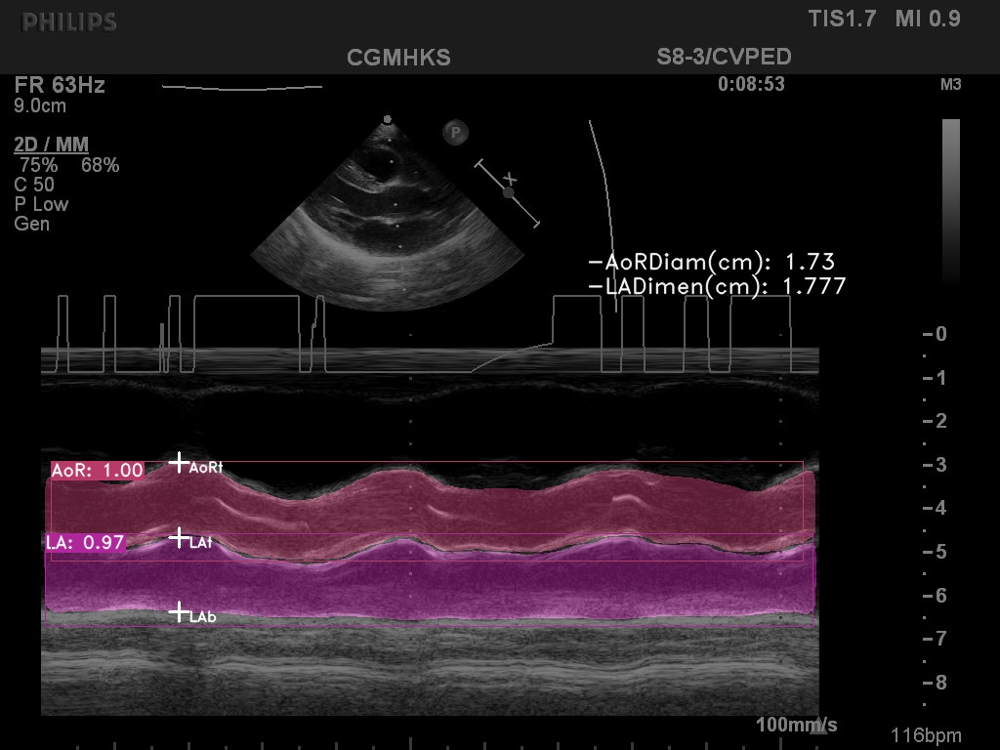
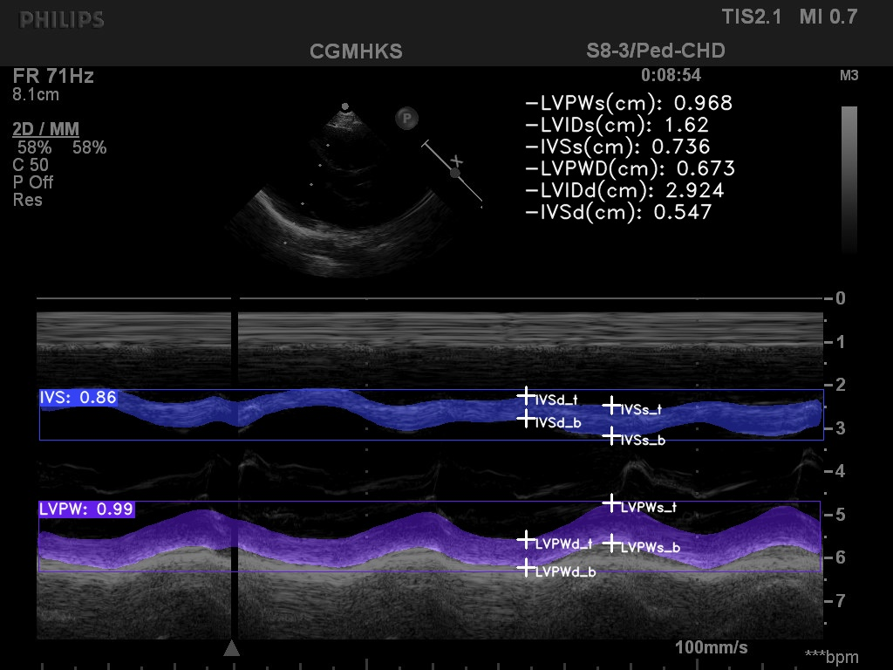

# Label Assignment of Real-time Automatic M-mode Echocardiography Measurement

This is based on the implemented code of [RAMEM](https://arxiv.org/pdf/2308.07717.pdf), And  RAMEM is modified based on [Yolact_minimal](https://github.com/feiyuhuahuo/Yolact_minimal/tree/master).

### dataset - MEIS
**MEIS** (the M-mode echocardiograms dataset in COCO format) at [link](https://drive.google.com/drive/folders/1Ve3UC9pP-FO5wN5MLB9OiKBAs7xAGkeN?usp=sharing).

The AV (left) and LV (right) labelling results based on prediction mask in a real-time instance segmentation can be as the following.

The modified version of label assignment is mostly in the file "utils/box_utils.py"
